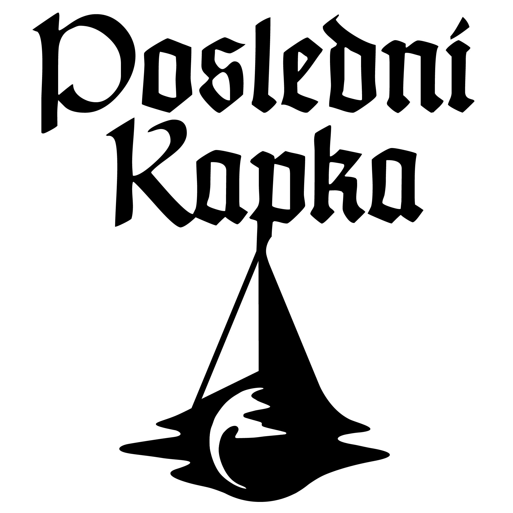

# Poslední Kapka
Poslední Kapka is a fantasy platformer game made in Unity3D engine. It is currently in the stage of prototype.

## Team
Jiří Bednář - game design, level design, dialogues, story

Katarína Bazelová - game design, graphic design, textures

Petr Eric Hofmann - game design, 2D artist, story

Pavel Ježek - game design, scripting

